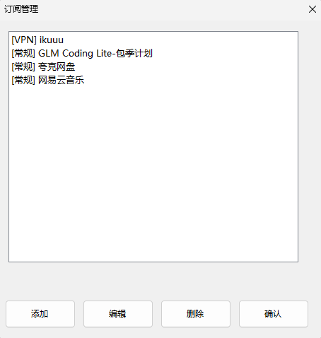

# Reminder - 订阅提醒桌面悬浮窗

一个简洁优雅的 Windows 桌面悬浮窗应用，用于显示订阅到期倒计时和 VPN 流量统计。


## 功能特性

### 核心功能
- **桌面悬浮窗** - 圆角窗口、半透明背景、置顶显示
- **订阅管理** - 支持常规订阅和 VPN 订阅两种类型
- **实时倒计时** - 显示距离到期的剩余天数
- **VPN 流量统计** - 显示已用流量、总流量、剩余流量
- **拖动定位** - 鼠标左键拖动窗口到任意位置
- **开机自启** - 支持开机自动启动
- **系统托盘** - 最小化到系统托盘，双击托盘图标恢复窗口
- **排序功能** - 支持按剩余时间升序/降序排列
- **手动刷新** - 支持手动刷新 VPN 数据

### 界面特点
- 现代化圆角窗口设计（Windows 11 风格）
- 深色主题，视觉舒适
- 自适应窗口高度
- 文字区域可交互（支持拖动和双击）

## 界面预览

悬浮窗显示以下信息：
- **常规订阅**：名称、到期时间、剩余天数
- **VPN 订阅**：名称、已用/总流量、剩余流量、剩余天数





## 快速开始

### 下载发布版本

从 [Releases](https://github.com/yourusername/Reminder/releases) 页面下载最新的 `Reminder.zip`，解压后直接运行 `Reminder.exe`。

### 前置要求

- Windows 10 或更高版本
- .NET 8.0 Runtime（如果系统未安装，程序会提示）

### 从源码构建

```bash
git clone https://github.com/yourusername/Reminder.git
cd Reminder
dotnet build --configuration Release
```

运行程序：
```bash
.\bin\Release\net8.0-windows\Reminder.exe
```

## 使用说明

### 基本操作

| 操作 | 功能 |
|------|------|
| 双击悬浮窗 | 打开订阅管理窗口 |
| 左键拖动 | 移动悬浮窗位置 |
| 右键点击 | 打开右键菜单 |
| 托盘双击 | 恢复窗口显示 |

### 右键菜单

- **管理订阅** - 打开订阅管理窗口
- **刷新数据** - 手动刷新 VPN 流量数据
- **剩余时间排序** - 按剩余时间升序/降序排列
- **开机自启动** - 设置开机自动启动
- **最小化** - 隐藏到系统托盘
- **退出** - 退出程序

### 订阅类型

#### 常规订阅
适用于需要跟踪到期日期的服务，如：
- 软件订阅
- 会员服务
- 租赁服务

#### VPN 订阅
适用于需要跟踪流量使用的 VPN 服务：
- 支持通过 URL 获取流量信息
- 自动解析多种 API 格式
- 支持标准订阅 URL（通过响应头获取流量）
- 支持流量统计 API

### 配置说明

配置文件位于程序目录下的 `config.json`：

```json
[
  {
    "Type": "Regular",
    "Id": "unique-id",
    "Name": "示例订阅",
    "CurrentSubscriptions": 100,
    "TotalSubscriptions": 1000,
    "ExpiryDate": "2025-02-16T10:30:00"
  },
  {
    "Type": "VPN",
    "Id": "unique-id",
    "Name": "我的VPN",
    "Url": "https://example.com/api/traffic",
    "Usage": {
      "UploadBytes": 1073741824,
      "DownloadBytes": 5368709120,
      "TotalBytes": 107374182400,
      "ExpireTime": "2025-02-16T10:30:00"
    }
  }
]
```

## 项目结构

```
Reminder/
├── Models/
│   ├── SubscriptionItem.cs        # 订阅项基类
│   ├── SubscriptionData.cs        # 订阅数据扩展
│   └── SubscriptionUsage.cs       # VPN流量使用情况
├── Services/
│   ├── ConfigService.cs           # 配置文件读写服务
│   ├── TimerService.cs            # 定时器服务（单例模式）
│   └── VPNSubscriptionService.cs  # VPN数据获取服务
├── Forms/
│   ├── SubscriptionManagerForm.cs      # 订阅管理窗口
│   ├── SubscriptionManagerForm.Designer.cs
│   ├── SubscriptionEditForm.cs         # 订阅编辑窗口
│   └── SubscriptionEditForm.Designer.cs
├── MainForm.cs                     # 主悬浮窗
├── MainForm.Designer.cs            # 主窗体设计器
├── Program.cs                      # 程序入口
├── Reminder.csproj                 # 项目配置
└── config.json                     # 配置文件（运行时生成）
```

## 技术栈

- **框架**: .NET 8.0 Windows
- **UI 框架**: Windows Forms
- **序列化**: System.Text.Json
- **HTTP**: HttpClient（静态共享）
- **语言**: C# 12

## 核心实现

### 圆角窗口

使用 DWM API 实现 Windows 11 风格圆角：

```csharp
[DllImport("dwmapi.dll", CharSet = CharSet.Auto)]
private static extern int DwmSetWindowAttribute(IntPtr hwnd, int attr, ref int attrValue, int attrSize);

private void SetRoundedCorners()
{
    int preference = DWMWCP_ROUND;
    DwmSetWindowAttribute(this.Handle, DWMWA_WINDOW_CORNER_PREFERENCE, ref preference, sizeof(int));
}
```

### 事件穿透

Label 控件将鼠标事件转发给父面板：

```csharp
label.MouseDown += (s, e) =>
{
    var panelLocation = label.PointToScreen(e.Location);
    var panelArgs = new MouseEventArgs(e.Button, e.Clicks,
        panelLocation.X - this.PointToScreen(Point.Empty).X,
        panelLocation.Y - this.PointToScreen(Point.Empty).Y, e.Delta);
    this.OnMouseDown(panelArgs);
};
```

### 内存优化

- 使用静态共享 HttpClient，减少资源占用
- 复用 JsonSerializerOptions，避免重复创建
- 启用服务器 GC 模式
- 单例模式的 TimerService

## VPN API 支持

程序支持多种 VPN 流量 API 格式：

1. **标准订阅 URL** - 通过响应头 `subscription-userinfo` 获取流量信息
2. **JSON API** - 解析多种 JSON 响应格式
3. **Base64 编码** - 自动解码 Base64 编码的响应
4. **V2Ray/Xray 格式** - 支持 `upload/download/total/expiry` 字段

示例 API 响应格式：

```json
{
  "success": true,
  "data": {
    "used": 1073741824,
    "total": 107374182400,
    "expiry": 1735689600
  }
}
```

## 版本历史

### v1.0.0 (2025-01-19)
- 初始稳定版本发布
- 支持常规订阅和 VPN 订阅
- 桌面悬浮窗显示
- 系统托盘集成
- 开机自启动功能
- 排序功能
- 手动刷新 VPN 数据

## 贡献

欢迎提交 Issue 和 Pull Request！

## 许可证

MIT License - 详见 [LICENSE](LICENSE) 文件

## 作者

Created with ❤️CowanNath

---

**注意**：本程序仅用于个人订阅管理，请勿用于商业用途。
